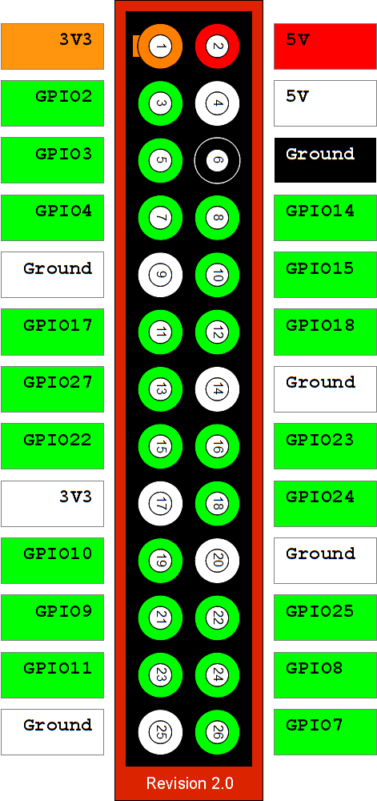
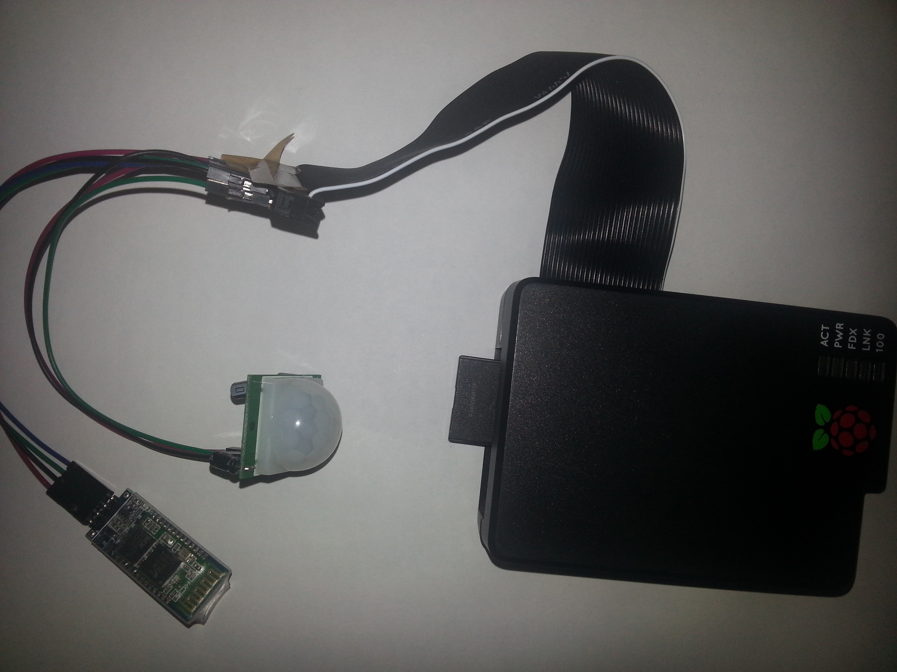
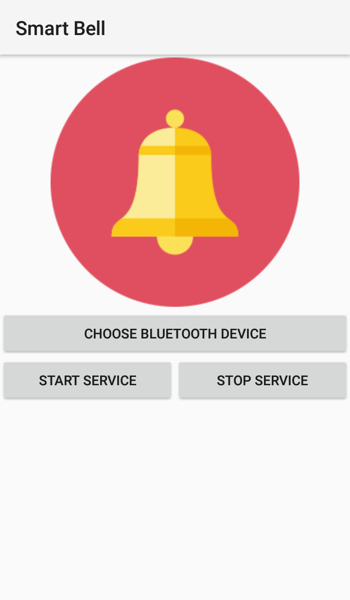
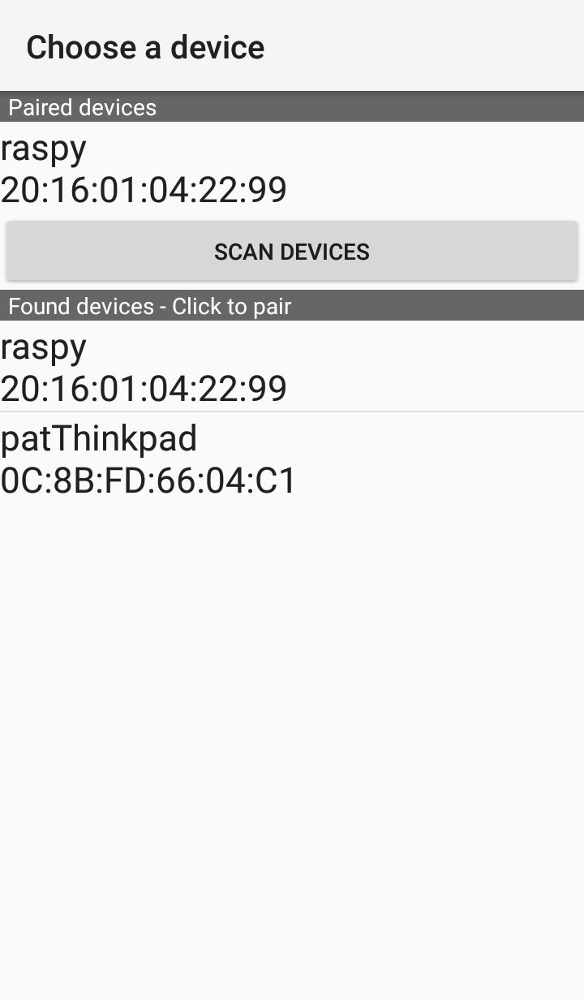
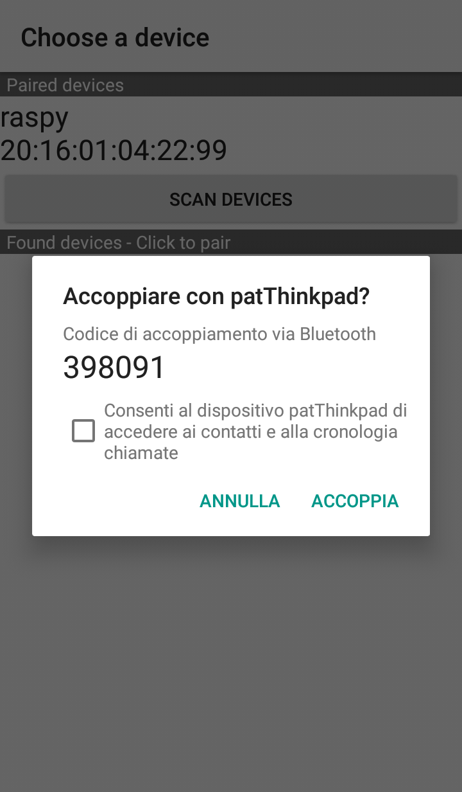
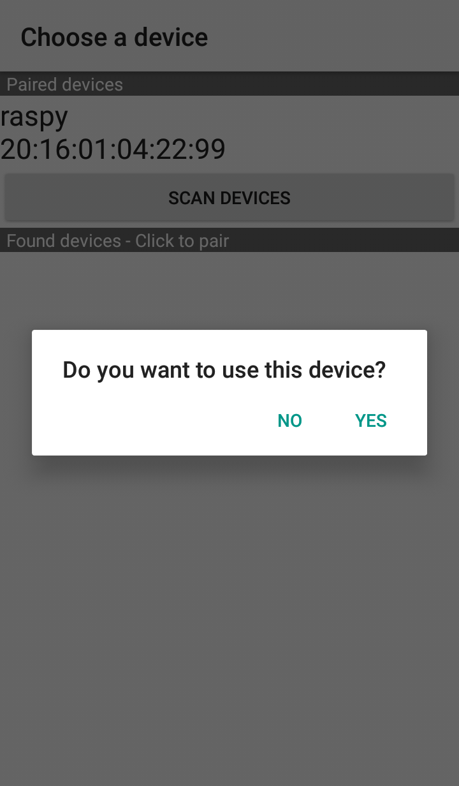
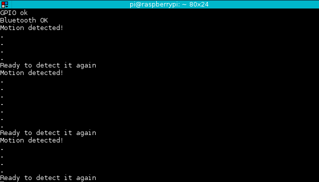
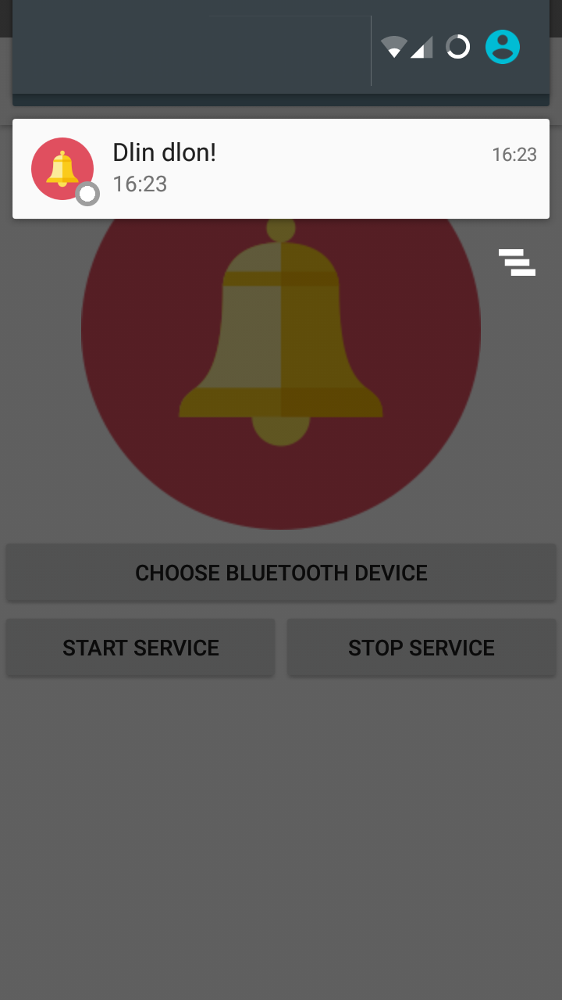

#Smart Bell - Documentation

## Use case
A shop keeper spends a lot of time in the back shop, so he wants to be alerted when someone enters his shop.
He has his Android smartphone always with him, so it would be awesome if he could get notified as soon as someone passes the door of his shop.

## Solution provided
The solution provided has been built using a Raspberry PI, a passive infrared motion sensor and a cheap serial bluetooth adapter.
When someone passes in front of the sensor, the Raspberry PI gets a GPIO signal and sends a byte over Bluetooth using the SPP service.
The smartphone reads the serial stream through Bluetooth and notifies the shop keeper ringing, vibrating and showing an alert on screen.

## Hardware
### Wishlist
- Raspberry PI model 0 - € 8,00
- PIR Sensor - € 1,00
- HC-06 Bluetooth Adapter - € 5,00
- GPIO wires - € 1,00
- Android Smartphone


### Components used in experiment
- Raspberry PI 1 - Model B
- PIR Sensor
- HC-06 Bluetooth adapter
- GPIO Wires
- 40pin GPIO cable

### Raspberry PI
Raspberry PI is a series of single board computers developed with the intent to promote the teaching of computer-science in schools. 
Cheap and credit-card sized, Raspberry PI's hardware has become an affordable solution to build embedded systems integrated with electronics.
Main components include a Broadcom BCM283* SoC, that offer a 700MHz ARM11 processing unit, a VideoCore IV GPU, and RAM.
Raspberry PI features one to four USB slots, HDMI and composite video, and a 3.5mm phono jack for audio. Lower level input is managed through GPIO pins, with the support of many known protocols like I2C or UART/TTL.
It doesn't provide on-board storage: the operating system and all the data are stored on an external SD-card (microSD format in the PI zero).
It can run Linux-kernel based operating systems, and a lot of Linux distribution have been created to work on its platform, such as Raspbian (that is to say Debian for Raspberry).
Some models include a 8P8C ethernet chipset, and the most recent version of the board includes also an on-board Wifi802.11 and Bluetooth Chip.
The cost of these boards goes from 20 to 35 dollars. The version "Zero" comes with a smaller footprint and limited GPIO capabilities, at the cost of 5$.

### Passive InfraRed motion detection sensor
A passive infrared sensor is an electronic sensor that measures infrared light radiating from objects in its field of view.
It is often used in motion detection sensors, that are commonly used in anti-theft systems or automatically activated lighting systems, to sense the movement of people, animals, objects.
A passive infrared doesn't sense movement on its own: it detects changes in the amount of infrared radiation impinging upon it.
When something or someone passes in front of a background it causes a variation in temperature that is translated in infrared radiations and then converted in the output voltage that triggers the detection.
Objects with similar temperatures but different characteristics in material or surface may have different infrared emission pattern, and they could trigger the detector as well.
PIR sensors are available with many configurations for a big variety of applications.
Some sensors implement the so called Fresnel lenses, or mirror segments, that allow to detect objects within a range of 10-12 meter maximum and a field of 300 degrees.
There are also PIR sensors that allow to detect objects within a field of 360 degrees that are often applied at the ceilings; some other larger PIR sensors can cover distances in the order of many hundred meters.
The PIR sensor I've used for this demo offers an high signal of three volts point three when it detects a movement, with an output current of 10mA.
It has a field of 140 degrees and an operating range of about 7 meters.
#### PINs
On the chip we have three pins: 
- VCC (Voltage, 5V)
- OUT (Output, out 3.3V when motion is detected)
- GROUND (Ground)

### Bluetooth module HC-06
The HC-06 bluetooth module is an hardware bluetooth module that implements Bluetooth v2.0 specifications plus EDR (with Secure Simple Pairing and Extended Inquiry Response).
It comes as a drop-in replacement for wired serial connection: it acts as serial port and its usage is transparent to the user.
You can program it sending AT commands directly to the serial interface.
The instruction set is this:
- **Command: _AT_**  - to test communication
**Response: _OK_**
- **Command: _AT+BAUD<N>_** - to set baudrate. N can be one of
```
1 -> 1200
2 -> 2400
3 -> 4800
4 -> 9600 (Default value)
5 -> 19200
6 -> 38400
7 -> 57600
8 -> 115200
9 -> 230400
A -> 460800
B -> 921600
C -> 1382400
```
**Response: _OK<n>_**
- **Command: _AT+NAME<name>_**  - to set the Bluetooth device's name (limited to 20 characters)
**Response: _OK<name>_**
- **Command: _AT+PIN<pin>_**  - to set the Bluetooth device's pairing PIN
**Response: _OKsetpin_**
- **Command: _AT+VERSION_**  - to get the module's firmware revision version
**Response: _<VersionNumber>_**

There are also other commands to set the parity check. Those are:
- **AT+PN** to turn off parity check (default)
- **AT+PO** to turn on odd parity check
- **AT+PE** to turn on even parity check

HC-06 bluetooth module shares his architecture with the HC-05 module, but differently from it, HC-06 can only be a slave. That is to say that he cannot inquiry devices or start communications on its own. This could be a limitation, but for most use cases (especially mine) it's enough.
#### PINs
On the chip we have four pins: 
- VCC (Voltage, indicated in the range of 3.6V-6V)
- GND (Ground)
- TXD (Serial *output* of the module, to be connected to RX of the microcontroller or board. It uses a 3.3V logic level.)
- RXD (Serial *input* of the module, to be connected to TX of the microcontroller or board. It uses a 3.3V logic level.)
There are also two other pins, that are not available for usage:
- State (Indicates the state of the module, and it's already connected to a led that can be always on, when connected, or blinking, when available for connection)
- En (To enable the AT mode, pulled up by default in HC06)

### Wiring things together
To plug things together more easily I have used a 42-pin GPIO cable for the Raspberry, that allowed me to bring the GPIO interface out of the case of the Raspberry PI.
I have used cables of four different colors:
- Red for power voltage
- Green for TX signal
- Blue for RX signal
- Black for ground

This is the Raspberry PI Gpio header schema.

<center>

</center>

For the PIR sensor I have linked the VCC pin to the Raspberry's pin n. 4 (5 volt power channel), the OUT pin (signal) to the Raspberry's pin n.24 (GPIO 8) and the GND pin to Raspberry's pin n.6 (Ground).

For the Bluetooth HC-06 module I have linked the VCC pin to the Raspberry's pin n.2 (5 volt power channel), the GND pin to Raspberry's pin n. 14 (Ground), the RX pin to Raspberry's pin n. 8 (GPIO14, TX) and TX  to Raspberry's pin n.10 (GPIO15, RX).

######Result:

<center>

</center>

## Software
### Raspberry PI
#### Setup Raspberry PI
The Raspberry PI has to be set up to work properly with the HC-06 bluetooth module.
This module is recognized as serial port, and can be called on the Raspberry using the virtual terminal interface `/dev/ttyAMA0`.
By default the Raspberry serves a login terminal to `/dev/ttyAMA0` through `getty`, so that one can control the Raspberry without a video output, using the TTL UART interface.
This behavior has to be disabled. First of all we have to tell the kernel to turn off the `ttyAMA0` console and prevent it to log debugging informations on it. To do that I removed the `console=ttyAMA0,115200 kgdboc=ttyAMA0,115200` string from the file `/boot/cmdline.txt`.
The last step is to turn off getty. Depending on the operating system we have two options:
- If the operating system is SystemD based, we can simply stop and disable the service through `systemctl` with
```
sudo systemctl stop serial-getty@ttyAMA0.service
sudo systemctl disable serial-getty@ttyAMA0.service
```
- If the operating system is SysVinit or other init system based we can simply comment out the line 
`T0:23:respawn:/sbin/getty -L ttyAMA0 115200 vt100` in `/etc/inittab`.

Then we have to setup the serial module customizing our preferences, keeping in mind of its default values.
I did it programmatically with Python but one can use a simple serial terminal.
```
import serial
btserial = serial.Serial("/dev/ttyAMA0", baudrate=9600)
btserial.write("AT+BAUD115200")
btserial.close()
btserial = serial.Serial("/dev/ttyAMA0", baudrate=115200)
btserial.write("AT+NAMEraspy")
btserial.write("AT+PIN0000")
btserial.close()
```

#### Code on Raspberry PI

The code running on the Raspberry PI for my purpose is a simple daemon that sends a byte on the serial channel everytime it receives a signal on the GPIO 8.

```
import RPi.GPIO as GPIO
import time
import serial
GPIO.setmode(GPIO.BCM) # We set the GPIO in BCM mode
PIR_PIN = 8 # We save in a variable the PIN to which the PIR sensor is connected
print("Motion detection system with Bluetooth - Patrizio Tufarolo <patrizio.tufarolo@studenti.unimi.it>")
print("Project for Wireless and Mobile Networks - a.y 2015-2016")
GPIO.setup(PIR_PIN, GPIO.IN) #We setup the GPIO
time.sleep(2)
print("GPIO ok")
btserial = serial.Serial("/dev/ttyAMA0", baudrate=115200) #We setup the serial communication with baudrate 115200
print("Bluetooth OK")
motion = False
try: 
    #While true, if we receive a signal on the GPIO, we send a byte on the serial line. The *motion* variable is used to distinguish one detection from another.
    while True:
        if GPIO.input(PIR_PIN):
            if not motion:
                print("Motion detected!")
                btserial.write("1")
            print(".")
            motion = True
        elif motion:
            print("Ready to detect it again")
            motion = False
        time.sleep(1)
except KeyboardInterrupt:
    GPIO.cleanup()
    try:
        btserial.close()
    except:
        pass
```

#### Libraries used

Libraries I used are:
- `RPi.GPIO` to read signals from the GPIO
- `time` to let the main thread sleep
- `pyserial` to send data on the serial port

#### Android Application

*Source code is available on GitHub at the address https://github.com/patriziotufarolo/BluetoothProximitySensor*

##### XAMARIN framework

The Android application is built on top of Xamarin framework.
Xamarin is a software company founded in San Francisco (California) by the engineers that created Mono, a cross platform implementation of the Common Language Infrastructure and Common Language Specification (.NET framework).
This framework allows developers to write software in C#, sharing the code between multiple platforms.
In fact, Mono includes Xamarin.iOS and Xamarin.Android that are implementations of Mono for iPhone and Android. After Microsoft's acquisition of Xamarin, the Mono runtime has been relicensed under the MIT license and both set of libraries are made free and open-source.
Using Mono, I've written a code that is easily portable to other platforms just adapting the interfaces of the Android library to the ones of the iOS library or the Windows Phone library.
To build the interface I've used the Android XML UI designer embedded in Microsoft Visual Studio Community edition.

##### Application workflow
The application developed is pretty simple. Once opened, it offers three buttons:
- Choose bluetooth device
- Start service
- Stop service

First of all the user has to choose which bluetooth device he has to connect to. The bluetooth device has to be paired with the smartphone.
Clicking on "Choose bluetooth device" the application will offer the user to choose the target device from the list of the already paired devices.
If the target device has not been paired yet, the application let the user start a scan and pair with a device with the PIN code.

The "Start service" button allows the user to start the background service that will read from the bluetooth serial and trigger a notification each time the pyroelectric infrared sensor detects a motion.
The "Stop service" button allows the user to halt the background service and stop receiving notifications.

##### Classes
###### Main Activity
**File**

*MainActivity.cs*

**Description**

This class renders the default Activity. It renders layout loading *Main.axml*, that is an XML formatted following Android's standards.

**Technical doc**

Inherits from: *Android.App.Activity*
Methods overriden:
- *protected void OnCreate(Android.OS.Bundle bundle)*

The only method I overrode is *onCreate* that is triggered when the Application is opened. The *onCreate* method renders the layout and binds the *onClick* event of each button to its action.


###### Bluetooth Device Choose Activity
**File**

*BluetoothDeviceChooseActivity.cs*

**Description**

This class renders the Activity that allows the user to inquiry for bluetooth devices around him, pair with them, and/or set a paired device as default, using the preferences storage.
The main characteristics of this activity are
- The usage of a *BluetoothDeviceAdapter*(#BluetoothDeviceAdapter) to directly bind the *BluetoothDevice* to an item of the ListView, both for paired and detected devices.
- The usage of a *BroadcastReceiver* to proper handle signals coming from the bluetooth adapter installed in the smartphone
- The usage of the system intent *BluetoothAdapter.ActionRequestEnabled* to enable the Bluetooth if it is not yet enabled

**Technical doc**

Inherits from: *Android.App.Activity*
***Methods overriden:***
- *protected void OnCreate(Android.OS.Bundle bundle)*

    The *onCreate* method here renders the layout and checks if the bluetooth adapter is enabled or not. If the bluetooth adapter is turned off, it will call the *BluetoothAdapter.ActionRequestEnabled* intent, otherwise it will populate the list of the paired devices through the method *populatedDevicesLists()*.
    It also binds the click event for the *Scan* button.

- *protected void OnActivityResult(int requestCode, [GeneratedEnum] Android.App.Result resultCode, Android.Content.Intent data*)

    This method manages the *BluetoothAdapter.ActionRequestEnabled* 's answer. If the bluetooth adapter gets enabled by the system Intent, the devices lists will be populated.

- *protected void OnDestroy()*
    When the activity dies this method will unregister the BroadcastReceiver and stop discovery activities on the Bluetooth adapter

- *protected void OnResume()*
    When the user resumes the activity this method will register the BroadcastReceiver back

- *protected void OnPause()*
    When the user puts the activity on pause this method will unregister the BroadcastReceiver and stop discovery activities on the Bluetooth adapter

**Declared methods:**

- *private void populateDevicesLists()*
    
    This method populates the paired devices list and sets up the *BluetoothDeviceAdapter*s for both inquired devices list and paired devices list.

- *private void defineReceiver()*
    
    This method attaches events to the Broadcast receiver, and registers the broadcast receiver to the activity by calling *Activity.RegisterReceiver*.

- *private void DoDiscovery()*
    
    This method starts the discovery of bluetooth devices, populating the inquired devices list.

- *private void DevicesListClick(object sender, Android.Widget.AdapterView.ItemClickEventArgs e)*
    
    This method handles the click event on any item in the inquired devices list, starting the pairing operation if the devices has not been paired yet.

- *private void PairedDevicesListClick(object sender, Android.Widget.AdapterView.ItemClickEventArgs e)*
    
    This method handles the click event on any item in the paired devices list, setting the clicked devices as default.

###### Bluetooth Device Adapter

**File**

*BluetoothDeviceAdapter.cs*

**Description**

This class allowed me to directly bind the *Android.Bluetooth.BluetoothDevice* object to items of the list view. It is build on top of a *List<BluetoothDevice>* and renders the *DeviceListItem.axml* layout for each element of the list.

**Technical doc**

Inherits from: *Android.Widget.BaseAdapter<T>* where *T* is *<Android.Bluetooth.BluetoothDevice>*

**Methods overriden:**

- *public int Count*

    It's a *get/set* property that returns the number of the items in the current instance of the object

- *public Java.Lang.Object GetItem(int position)*

    Returns the item at position *<position>*

- *public long GetItemId(int position)*

    Returns the ID of the item at position *<position>* (the ID is the same of the position, so it returns the value of *position*)

- *public void Add(BluetoothDevice device)*

    Adds an item to the List

- *public Android.Views.View GetView(int position, View convertView, ViewGroup parent)*

    Renders the view for the current list item


###### Proximity Service

**File**

*ProximityService.cs*

**Description**

This is the Android service that runs on the background and manages the logic of the application.
It implements a state machine that has the following states:
- NONE (initial state)
- LISTEN
- CONNECTING
- CONNECTED

Running in the background it manages the synchronization between the threads managed by the classes *BluetoothConnectThread* and *BluetoothConnectedThread*.


**Technical doc**

Inherits from *Android.App.Service*


***Methods overriden:***

- *public Android.OS.IBinder OnBind(Android.Content.Intent intent)*

    This method is executed when the service gets bound. It creates the ProximityServiceBinder for the service

- *public StartCommandResult OnStartCommand(Android.Content.Intent intent, [GeneratedEnum] Android.App.StartCommandFlags flags, int startId)*

    This method is executed when the service gets started. If the service can read a device address in the settings, and the bluetooth adapter is enabled, the connect thread is executed toward the specified device.

- *public bool StopService(Android.Content.Intent intent)*

    This method is executed when the service has to be stopped. It closes all the sockets and kill the threads, then ensure that the bluetooth adapter is not trying to discover devices bringing it in idle state.

- *public void OnDestroy()*

    Before destroying the service, it calls the stop method described below.

***Declared methods:***

- *private void setState(int state)*

    Private method that modify the state variable and notifies the caller intent, if exists.

- *private void connectToDevice(String address)*

    Private method that launches the *BluetoothConnectThread*, to establish connection with the Raspberry PI.

- *public void stop()*

    Public method that stops the service execution

- *public void connected(Android.Bluetooth.BluetoothSocket socket, Android.Bluetooth.BluetoothDevice mDevice)*
    
    Public method called when the connection is established, that calls the *BluetoothConnectedThread* to manage the connection and show notifications.

###### Proximity Service Binder

**File**

*ProximityServiceBinder.cs*

**Description**

This is the binder for the *ProximityService* class.

**Technical doc**

Inherits from *Android.OS.Binder*

***Declared methods:***

- *public bool isBound()*

    Boolean property that returns whether the service is bound or not

###### Base Thread

**File**

*BaseThread.cs*

**Description**

This class offers a small interface to use threads in C#. It is an abstract class that has an abstract method called RunThread, that represents the part of code to be executed when running the thread.

**Technical doc**

***Declared methods:***

- *public void Start()*

    Starts the thread

- *public void Join()*

    Waits for the thread's death

- *public bool IsAlive*

    Boolean property that returns whether the thread is alive or not

- *public abstract void RunThread()*

    Abstract method that has to be overidden, that represents the part of code to be executed when running the thread.


###### Bluetooth Connect Thread

**File**

*BluetoothConnectThread.cs*

**Description**

This class inherits from *BaseThread* and controls the connection to the bluetooth device. 
The method *Android.Bluetooth.BluetoothDevice.Connect* is synchronous and blocking, so its execution would block the UI thread and all flows inside the application, so I've decided to run it in a separate thread, synchronized with the *BluetoothConnectedThread*(#BluetoothConnectedThread), that manages the bluetooth connection once established.

**Technical doc**

Inherits from: *BaseThread*

***Methods overriden:***

- *public void RunThread()*

    Manages the connect thread. It tries to connect to the bluetooth device, first using the *CreateRfcommSocketToServiceRecord* method. If it fails, for fallback, it invokes the method *CreateRfcommSocket* by using Java reflection (required in most recent version of Android).
    Once connected, asks the main thread to execute the *BluetoothConnectedThread*(#BluetoothConnectedThread).
    The RFCOMM socket is created with the service UUID of serial protocol over bluetooth `00001101-0000-1000-8000-00805f9b34fb`.

***Declared methods:***

- *public void Cancel()*

    Closes the bluetooth socket and let the thread die.


###### Bluetooth Connected Thread

**File**

*BluetoothConnectedThread.cs*

**Description**

This class inherits from *BaseThread* and handles the bluetooth connection once established. 

**Technical doc**

Inherits from: *BaseThread*

***Methods overriden:***

- *public void RunThread()*

    Manages the connected thread. The thread body executes a loop while the bluetooth socket is active, in which it tries to read data from Bluetooth serial. If it receives some data sent by the Python script running on the Raspberry PI, it sends a notification to the device, playing a sound, powering on the notification light and showing an alert on the device.

***Declared methods:***

- *public void Cancel()*

    Stops the thread body execution, closes the bluetooth socket and let the thread die.

##### Screenshots








### Cost evaluation

- Android Smartphone € 50,00
- Raspberry PI model 0 - € 8,00
- PIR Sensor - € 1,00
- HC-06 Bluetooth Adapter - € 5,00
- GPIO wires - € 1,00
- Professional to wire things together e solder € 50,00
- Professional to write code for the application: € 35,00/h for about 30 hours (about 1000€)
